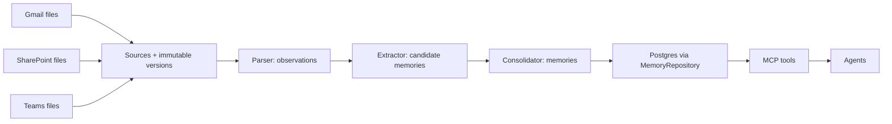
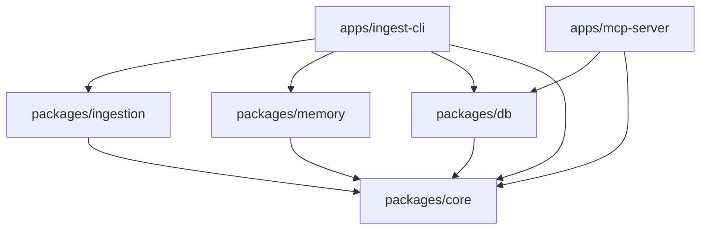

# TunnelVision

TunnelVision preserves organisational memory while Gmail, SharePoint, and Teams
remain the systems of record. The POC uses repository-local
`mock-data/nike/{gmail,sharepoint,teams}/` directories in their place.

## Data flow

Parsers preserve evidence locations in source versions. Extractors propose typed
memories and entity mentions. Consolidation resolves aliases, reconciles existing
memory, and persists entity links, evidence, and semantic edges. MCP will query
the same repository contract. Only these contracts exist today.

## Package dependencies

Arrows point from a consumer to its dependency. The dependency graph is acyclic.

`core` owns Zod models and the repository/parser/extractor/consolidator interfaces.
`db` will adapt them to Postgres and Drizzle; `ingestion` will parse and extract;
`memory` will consolidate. Apps will compose these packages. Implementations must
import the contracts from `@tunnelvision/core` rather than redefine them.

## Contract conventions

- IDs are opaque strings; all repository operations carry a tenant ID. Adapters
  must enforce tenant boundaries and the source/version relationship of evidence.
- Source identity is `(tenantId, system, externalId)`. Versions are immutable and
  keyed by `(tenantId, sourceId, version)`; retries must preserve IDs and snapshots.
  The POC stores text snapshots, including text-based JSON message exports.
- Entity types and alias kinds are open strings. Alias lookup uses exact kind/value
  matching and returns every match; resolution must handle ambiguous names.
- `Memory.content` is any JSON value. Domain-specific fields belong inside it;
  no client-specific columns are part of the contracts. Timestamps are ISO strings
  with a timezone; `occurredAt: null` means the event time is unknown.
- Candidates retain evidence and unresolved entity mentions. Consolidated memories
  use `MemoryEntity`, `MemorySource`, and directed `MemoryEdge` links. A `resolves`
  edge points from a resolution to an issue; `supersedes` points from new to old.
  Semantic memory links may contain cycles; the DAGs above describe data flow and
  package dependencies.
- Lists use offset pagination (default 50, maximum 100). Timelines use event time,
  falling back to creation time. Open issues exclude resolved and superseded ones.

No database schema, ingestion behavior, MCP tools, UI, authentication, or embeddings
are implemented in this scaffold.
